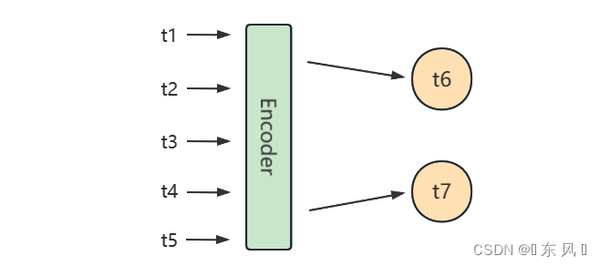

# 时间序列多步预测经典方法总结

## 直接多输出预测

对于这个策略是比较好理解与实现的，就是训练一个模型，只不过需要在模型最终的线性层设置为两个输出神经元即可。

正常我们的单输出预测，预测未来一天的模型最终的输出层为 `nn.Linear(hidden_size，1)`
，对于直接多步预测我们修改输出层为 `nn.Linear(hidden_size，2)` 即可，最后一层的两个神经元分别预测 t6 和 t7

定义的模型结构状态为：【t1，t2，t3，t4，t5】 🔜 【t6，t7】

对于这种策略优点就是预测 t6 和 t7 是独立的，不会造成误差累计，因为两个预测状态会同时通过线性层进行预测，t7 的预测状态不会依赖
t6，那么缺点也很显然，就是这两个状态独立了，但是现实是因为这是时序问题，t7 的状态会受 t6 的状态所影响，如果分别独立预测，t7
的预测状态会受影响，造成信息的损失。

## 单步滚动预测

递归多步预测就是利用递归方式进行预测未来状态，该策略会训练一个模型，然后依次按照时序递归进行预测，先利用已知时序数据预
测 t6 ，然后在滑动一个窗口，利用刚刚预测出的 t6 去预测 t7 的状态。

定义的模型结构状态为：

【t1，t2，t3，t4，t5】 🔜 【t6】

【t2，t3，t4，t5，t6】 🔜 【t7】

但是这种策略也会存在缺点就是因为是递归预测会导致误差累计，举了例子就是如果模型在预测 t6 的过程中出现了偏差，导致 t6 的
预测结果异常，然后模型会拿着 t6 的值去预测 t7 ，这就会导致 t7 的预测结果进一步产生误差，也就是会导致误差累计效应。
还有一个缺点就是该种实现策略利用递归策略，不断滑动窗口拿着刚预测出来的值预测下一个值，会导致性能降低，无法并行同时预测
t6 和 t7 的状态。

## 直接多步预测

这种策略意如其名，就是直接输出未来两天的状态，注意一下，不要与 1 直接多输出预测 混淆，不同于它，该策略会同时训练两个模
型，其中一个模型用于预测 t6 ，另外一个模型用于预测 t7 ，也就是你要预测多少个未来状态，你就需要训练多少个模型。

定义的模型结构状态为：

model_t6: 【t1，t2，t3，t4，t5】 🔜 【t6】

model_t7: 【t1，t2，t3，t4，t5】 🔜 【t7】

这种实现策略会有一定的缺点，由于我们是要多步预测，那么就需要训练对应输出数目个模型，如果我们要预测未来10天的状态，那么
我们就需要训练10个模型，会导致计算资源消耗严重，第二个缺点就是没有考虑到 t6 和 t7 的时序相关性，因为 t7 的状态会受 t6
的状态影响，这种实现策略会独立训练2个模型，所以预测 t7 的模型缺少了 t6 的信息状态，造成信息损失。

## 直接递归混合预测

这种策略融合 递归多步预测 和 直接多步预测 两种策略，它会分别训练两个模型，分别用于预测 t6 和 t7 ，与直接多步预测不同的是
在预测 t7 利用到了预测 t6 模型的输出结果，即 t6 的预测结果。

定义的模型结构状态为：

model_t6: 【t1，t2，t3，t4，t5】 🔜 【t6】

model_t7: 【t2，t3，t4，t5，t6】 🔜 【t7】

这种方式的有点就是解决了 直接多步预测 的信息独立问题，在预测 t7 的过程中考虑到了 t6 的状态。

## seq2seq多步预测

这种实现策略与 直接多输出预测 一致，不同之处就是这种策略利用到了 seq2seq 这种模型结果，seq2seg
实现了序列到序列的预测方案，由于我们的多步预测的预测结果也是多个序列，所以本问题可以使用这种模型架构。

定义的模型结构状态为：【t1，t2，t3，t4，t5】 🔜 【t6，t7】

对于这种模型架构相对于递归预测效率会高一点，因为可以并行同时预测 t6 和 t7 的结果，而且对于这种模型架构可以使用更多高精度的模型，
例如Bert、Transformer、Attention 等多种模型作为内部的组件

## 总结

我认为我们的模型只在 单步滚动预测 和 seq2seq多步预测（正好适合transformer） 中去选择。